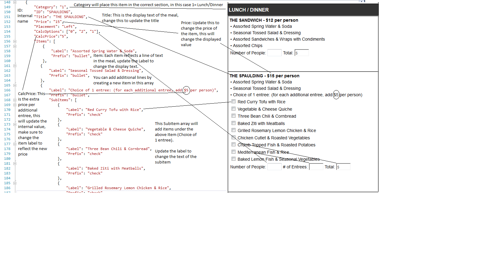

# CateringForm

Simple Catering Form.  Sections are modular and can be updated by changing the Data File

Built using jQuery and C#.  Backend functionality wont work. I left out the system files.  You'll get an error "something went wrong" when submitting the  form

Open Default.HTML for the main page

----------------------Documentation how to edit/add a section----------------------

Data.JS
Contains:
var Meals[]
var category[]
var calculationOptions[]

To update Price of an item:
Find the meal you want to update and change the price attribute. You may need to look under a meal‘s “Item” attribute if you are changing the price of an individual item.
This will change the displayed price as well as the internal price used for calculations.
If you are updating the additional price of entrees (such as for spaulding or zakim make sure to also update entree item label with the new price)

To update title:
To change the title of item box look for the attribute “Title” in a meal and change it. 
To change the text of an item that is listed inside a meal, look under “Items” or “SubItems” and change the Label attribute.

To add an Item or a line of text to a meal:
Each line of text for a meal goes into the array of the attribute “Item” for a meal. Include a Label tag which will be the text you want displayed. Include the prefix attribute if you want a bullet or a dash 

To add additional subItems (such as an extra entree to spaulding or a new item under the a la carte menu):
Find the meal that you are adding an item to. Look under the Items attribute and find the item you need to add the new subItem under. (for the first example above it would be under the item with the Label “Choice of 1 entree” ). The Label tag will be the text displayed. Include the prefix tag if you want a checkbox, bullet, or dash.

To add a meal:
To add a new meal you must add an item to the meals array. See below for details of what attributes are required and what they do

Parameters of Meals[]
* is required

Category:		meal type ID (0-4) see category[]
ID*			ID of the meal
Title*			Title of the meal (can be "")
Price*			Price of the meal (can be "")
Placement*		"Left" if starting a new row, otherwise ""
CalcOptions*		Type of inputs needed for item (Can be "") see calculationOptions[]
calcPrice		For meals that have suboptions with additional price (example: spaudling)
CalcAtt			If the input box needs to be hidden (see cakes)
Items[]*		To list the items in a meal. See below
SecondTitle		If a meal has 2 headers (See Icecream and Cakes)
SecondItems[]		To list the second set of items in a meal. Same format as Items
ThirdTitle		If a meal has 3 headers (See Cakes)
ThirdItems[]		To list the thirt set of items in a meal. Same format as Items

Items[]:
	Label*		Text to display (can be "")
	Price		Price of the item
	isHoriziontal	If subitems should be in a single row
	Prefix		"bullet"/"dash" (can be "")
	calcOptions	if each item needs calc options
	SubItems	see below

SubItems[]:
	Label*		Text to display
	Prefix		"check"(checkbox)/"bullet"/"dash" (can be "")
	Price		Price of the subitem
	Unit		free text (each/per platter/etc)	
	CalcOptions	if subitem needs calc options

var calculationOptions = [
    {
        "Id": "0",
        "Label": "Number of People"
    }, {
        "Id": "1",
        "Label": "Total"
    }, {
        "Id": "2",
        "Label": "# of Entrees"
    }, {
        "Id": "3",
        "Label": "Qty"
    }, {
        "Id": "4",
        "Label": "Writing"
    }
];
var category = [
    {
        "Id": "0",
        "Label": "BREAKFAST"
    },
    {
        "Id": "1",
        "Label": "LUNCHandDINNER"
    },
    {
        "Id": "2",
        "Label": "ALACARTE"
    },
    {
        "Id": "3",
        "Label": "DESSERT"
    }
];

